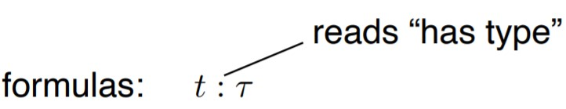
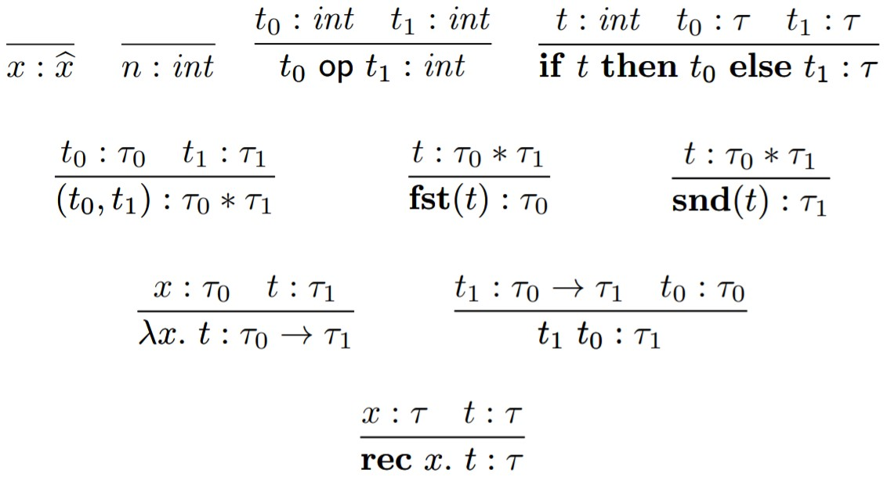
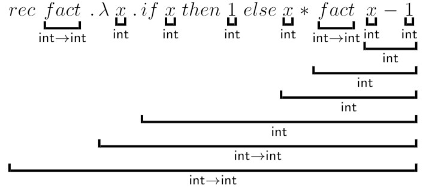
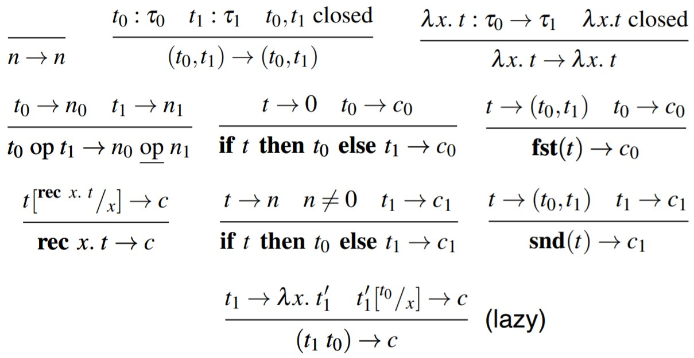

# HOFL typing in prolog
Higher order functional language typing in prolog. <br>
The program reads a typeable HOFL term and assigns types to it producing a LaTeX representation.
There are also auxiliar predicates for capture-avoiding substituitions, free variables, canonical form derivation, canonical form checking

## HOFL

### Terms


The actual syntax differs by:
- lambda is replaced by a backslash \
- multiplication symbol is *

### Types

τ ::= int | τ0 * τ1 | τ0 → τ1


### Type judgements



types are assigned to pre-terms using a set of inference rules
(structural induction of HOFL syntax)

### Type system


### Type inference
Type rules are used to derive type constraints (type equations) whose solutions (via unification) define the principal type.

#### Produced typed term


### Canonical form
We assign semantics only to terms that are well-formed and closed.

#### Lazy operational semantics


# Requirements & Usage

Requirements:
- SWI-Prolog

Usage:
```bash
$ swipl hofl.pl <?opts> ?term
```
To avoid possible errors with the prolog syntax it is recommended to write the term as a string (i.e. "term")
Flag | Type | Description
------------ | ------------- | -------------
 -h, --help |  |  show the help message
 -m, --mode | Atom | Modes are: <br> - canonical: derive the canonical form <br> - typing: assigns types to a term
 -f | Atom | read term from \<path\>
 -o | Atom | write output (typing) to \<path\>


