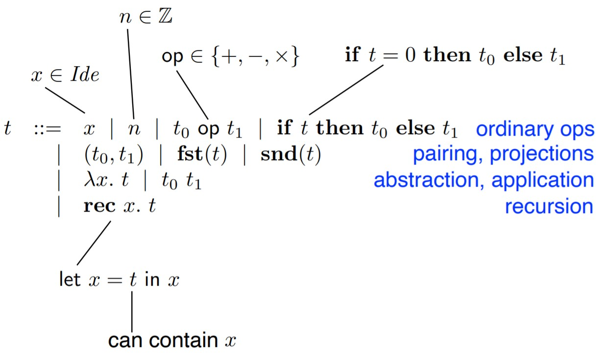
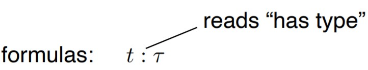
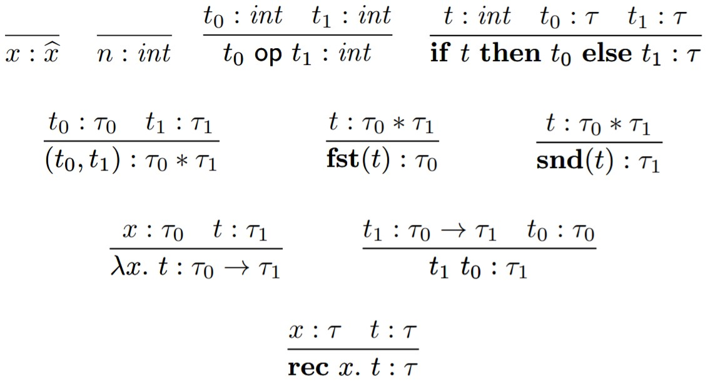
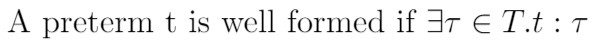
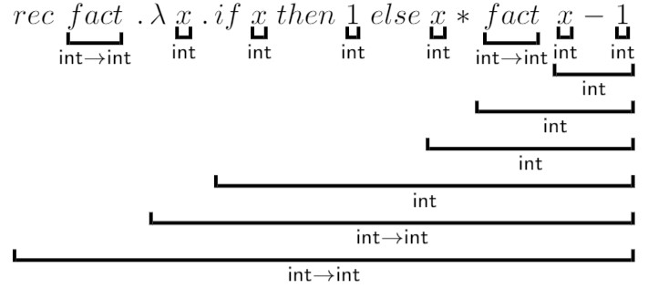

# hofl-typing-in-prolog
Higher order functional language typing in prolog.
The program reads a typeable HOFL term and assigns types to it producing a LaTeX representation.

## HOFL

### Terms

### Types

τ ::= int | τ0 * τ1 | τ0 → τ1

### Type judgements

types are assigned to pre-terms using a set of inference rules
(structural induction of HOFL syntax)

### Type system

#### Well Formed term

### Type inference
Type rules are used to derive type constraints (type equations) whose solutions (via unification) define the principal type.

#### Produced typed term

