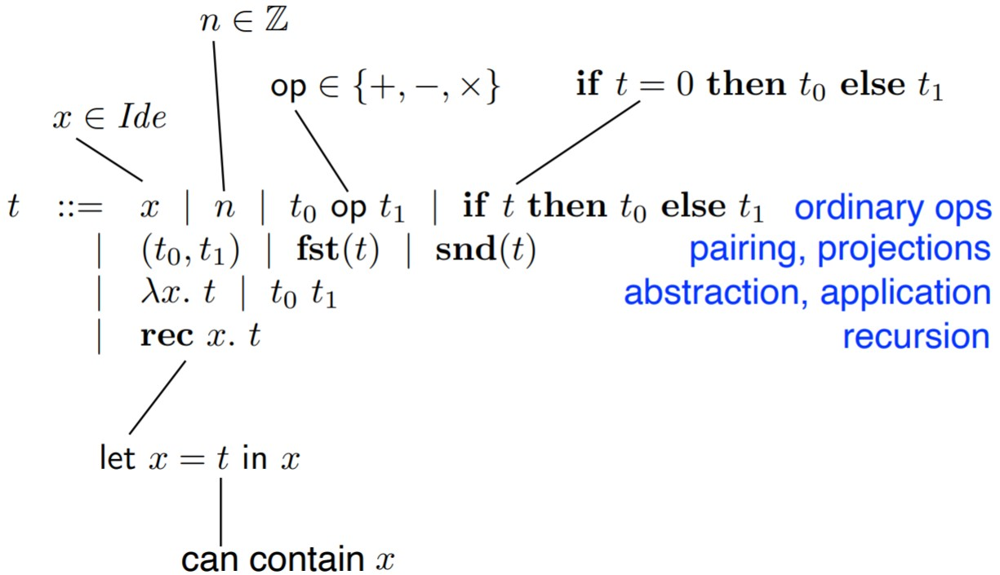

# HOFL typing in prolog
Higher order functional language typing in prolog.  
The program reads a typeable HOFL term and assigns types to it producing a LaTeX representation.
There are also auxiliar predicates for capture-avoiding substituitions, free variables, canonical form derivation, canonical form checking

## HOFL

### Terms

### Types

τ ::= int | τ0 * τ1 | τ0 → τ1

### Type judgements

types are assigned to pre-terms using a set of inference rules
(structural induction of HOFL syntax)

### Type system

### Type inference
Type rules are used to derive type constraints (type equations) whose solutions (via unification) define the principal type.

#### Produced typed term

### Canonical form
We assign semantics only to terms that are well-formed and closed.

#### Lazy operational semantics

# Usage

Requirements:
- SWI-Prolog
